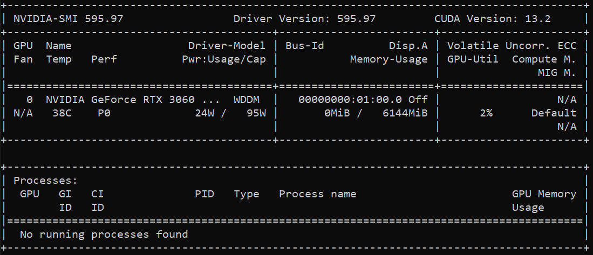
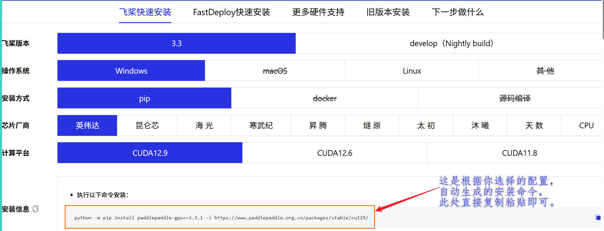
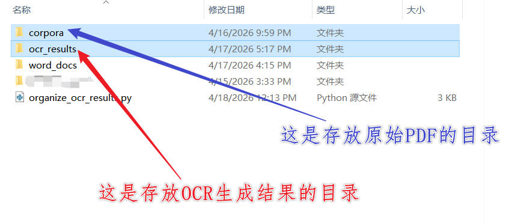

# 基于 PaddleOCR 的复杂版面 PDF 批量数字化流水线

## 项目介绍
本项目采用 **PaddleOCR** 作为核心光学字符识别（OCR, Optical character recognition）引擎，并专门调用其 **PP-StructureV3** 文档解析流水线，以应对大量语料文件中存在的**双栏、三栏、竖排、图文混排**等复杂PDF版面。至于 PaddleOCR 和 PP-StructureV3的**关系**，一句化说明白：PP-StructureV3 是 PaddleOCR 工具包内置的一个“高级文档解析流水线”。

### 项目用到的技术
1. PddleOCR 是一个开源的 OCR 引擎，Github地址：[PaddleOCR](https://github.com/PaddlePaddle/PaddleOCR) (版本 3.3.1+)
2. **PP-StructureV3** 是 PaddleOCR 中专门用于**复杂文档结构化**的高级功能，它集成了版面分析、文字检测、文字识别和阅读顺序恢复等多个模型，能够智能地识别文档中的标题、段落、表格、图片等元素，并输出符合人类阅读顺序的结构化文本。

### 项目实现的功能
通过跟随本项目的步骤，读者朋友将能够：
1.  **一键部署**：在本地 Windows/Linux 环境下快速搭建 GPU 加速的 PaddleOCR 环境。
2.  **批量处理**：对包含数百个复杂 PDF 的文件夹进行全自动处理。
3.  **结构化输出**：每个 PDF 将生成一个独立的文件夹，内含 Markdown 格式的文本（直接可作为语料用于大模型训练）、对应的.docx文件、JSON 格式的原始数据以及用于质量检验的可视化图片。

---

## 使用步骤

### 1. 创建虚拟环境
这里推荐使用 **Miniconda** 来管理 Python 环境，以避免包依赖冲突。本项目使用 **Python 3.9**，因为 PaddleOCR 的某些依赖库（如 `zoneinfo` 和 `modelscope`）需要 Python 3.9 或更高版本才能稳定运行。具体指令如下：

```powershell
# 创建一个名为 paddleocr_env，Python 版本为 3.9 的虚拟环境
conda create -n paddleocr_env python=3.9 -y

# 激活该环境
conda activate paddleocr_env
```

### 2. 安装组件
1. **安装 PaddlePaddle GPU 核心框架** ：
    - 这是飞桨（PaddlePaddle）的 **GPU** 版本，用于调用 NVIDIA 显卡加速 OCR 运算。这里说一下，实测即使是残血的 3060 也妥妥够用。
    - 首先我们要在命令行输入 `nvidia-smi` 命令，来查看当前系统的**CUDA版本**，up 自己的CUDA版本如下图所示：  
      
        
    - 拿到CUDA版本后，就可以去PaddleOCR官网去获取下载命令了。地址：https://www.paddlepaddle.org.cn/install/quick?docurl=/documentation/docs/zh/develop/install/pip/windows-pip.html
    - 这里补充一条提示：如果你发现自己的CUDA版本过低，强烈建议去 **NVIDIA** 官网下载最新的驱动，更新CUDA版本，否则低版本的 CUDA 是不支持某些 Paddle 所需的依赖的，容易报错。
    - 在官网，选择自己的机器配置，如下图所示：
      
        
    - 以 up 自己的配置为例，因为我的 CUDA 是`13.x`版本，所以我直接安装`12.9`也是兼容的（向前兼容）。这里建议大家**直接复制执行**官方生成的命令。
    - 这里我们第一步安装的，是**飞桨深度学习框架**，它提供 GPU 加速的底层数学运算，这是所有 `PaddleOCR` 功能的基础。
2. **安装 PaddleOCR 本体** :
    - 具体指令如下：  
      
        ```powershell
        pip install paddleocr
        ```
    - 这一步我们安装的是 `PaddleOCR` 工具包本体，它负责提供命令行入口和基础识别模型。
3. **安装 PP-StructureV3 所需的附加依赖** : 
    - PP-StructureV3 是处理复杂版面的核心模块，它并不包含在基础包中，需要单独安装。具体指令如下：
      
        ```powershell
        pip install "paddlex[ocr]"
        ```
    - 这一步我们安装的是 `PP-StructureV3` 所需的附加组件，因为版面分析模型、表格解析模型等高级依赖并不包含在 `paddleocr` 基础包中，需单独安装。
4. **安装 python-docx** : 
    - PaddleOCR 在保存 Word 文档时会调用此库。安装它也能避免程序在保存环节报错中断。具体指令如下：  

        ```powershell
        pip install python-docx
        ```
    - `PaddleOCR` 本身支持生成 docx 文件，该功能由 `PP-StructureV3` 流水线在输出时自动调用，但需要 `python-docx` 库作为运行时依赖。
### 3.测试环境是否就绪
测试指令如下： 
```powershell
# 1. 检查 PaddleOCR 命令是否可用
paddleocr --help

# 2. 验证 GPU 是否被 PaddlePaddle 正确识别
python -c "import paddle; paddle.utils.run_check(); import paddleocr; print('PaddleOCR 导入成功')"
```
如果输出包含 `PaddlePaddle works well on 1 GPU`. 和 `PaddleOCR 导入成功`，则环境完美就绪。

### 4. 执行命令（开始跑我们的模型）
- **前言** ：大家在执行指令之前，一定要确保所对应的两个文件夹已经提前创建好了，否则会报错。而且最好是将两个文件夹放在同一级目录下面，如下图所示：
　　
    
- **指令如下**：  

    ```powershell
    paddleocr pp_structurev3 -i "你的PDF文件夹路径" --save_path "输出结果路径" --device gpu --format markdown
    ```
- **指令参数详解**：  

    | **参数** | **说明** |
    | ------ | ------|
    | pp_structurev3 | 指定使用的流水线, 文档解析引擎。 |
    | -i 或 --input | 输入路径。可以是单个 PDF 文件，也可以是包含多个 PDF 的文件夹。 |
    | --save_path | 输出目录。所有生成的文件（Markdown、JSON、图片等）都将保存在此目录下。 |
    | --device gpu | 指定计算设备，使用 GPU 提速。 |
    | --format markdown | 指定文本输出格式。此处为 Markdown 格式。 |

- **指令执行的注意事项**：
    1. 首次运行会自动下载所需的模型文件（还不小），请耐心等待（我这边差不多10min有）。处理过程中，终端会显示进度条。
    2. 完成后，--save_path 指定的目录下将生成多个文件（每个 PDF 对应一个 .md 文件、一个 .docx 文件、一个 .json 文件及多张可视化图片）。

### 5.执行 Python 脚本：分门别类整理结果
- 如果只是直接跑完模型，由于模型是一页一页的处理PDF的，每一页的处理结果都是多份文件（包括docx、markdown、图片等），而每个PDF可能都是多页，所以输出结果的文件夹下会有一大堆文件。这时候，我们可以借助**Python脚本**来将每个 PDF 相关的所有文件（Markdown、docs、JSON、图片等）**自动归类**到以该 PDF 命名的独立子文件夹中。这样一来，不论是后续统一查看，还是编写新脚本合并文档，都会很丝滑！
- up 已经将写好的脚本放在了该仓库，大家估计已经看到了，就在上面的 `organize_ocr_results.py`，大家可以直接下载，当然，可以的话建议大家 **fork** 下本仓库，后续还可以提交 PR 噢。
- 脚本需要进行轻微的修改：主要是 存放PDF的路径 和 存放OCR结果 的路径，我在脚本中已经进行了标注。
- `organize_ocr_results.py`脚本的**执行命令如下**:  
  
    ```powershell
    python organize_ocr_results.py
    ```
- 这里再来简单说一下这个脚本的原理:
    1. **首先**，脚本会**扫描存放 PDF 的源文件夹**，获取所有 PDF 文件的“基础名”（不含扩展名）。
    2. **接着**，它会**遍历输出目录**下的所有文件，找出扩展名为 .md, .json, .jpg, .docx 等目标文件。
    3. **然后**, 它会利用**文件名前缀进行匹配**。PaddleOCR 生成的文件名通常以 PDF 基础名开头（例如 我的文档.pdf 会生成 我的文档.md、我的文档_layout.jpg 等）。脚本通过检查文件名是否以某个 PDF 基础名开头，将文件归入对应的组。
    4. **最后**，脚本为每个 PDF 基础名**创建**一个**子文件夹**，并将属于该组的所有文件移动进去。无法匹配的文件会被放入一个 _unclassified 文件夹，方便我们手动检查。

---

## 常见问题
1. **安装 PaddlePaddle GPU 版时出现 SSL 错误** : 
    - 现象：Anaconda Prompt 中出现提示 `SSLError` 或 `Could not fetch URL...`。
    - 原因：网络代理（如 VPN 或梯子）干扰了 pip 的 SSL 证书验证。
    - 解决方案：关闭代理软件后重试安装命令(如果开了梯子的, 试试把梯子关了重新执行安装命令)。

2. **执行 paddleocr pp_structurev3 时报错 DependencyError**: 
    - 现象：模型下载好后报错 `RuntimeError: A dependency error occurred... requires additional dependencies.`
    - 原因：未安装 PP-StructureV3 所需的额外组件。
    - 解决方案：执行命令安装缺失的附加包：  

        ```powershell
        pip install "paddlex[ocr]"
        ```
3. **执行命令后中断，报错 ModuleNotFoundError: No module named 'docx'** : 
    - 现象：程序在处理完部分内容后崩溃，提示缺少 docx 模块。
    - 原因：PaddleOCR 内部默认尝试保存一份 Word 文档，但环境中缺少 python-docx 库。
    - 解决方案：执行命令安装该库，然后重新运行相同的 PaddleOCR 命令。程序会智能地跳过已处理的 PDF，从断点继续。  

        ```powershell
        pip install python-docx
        ```
---

## 讨论 (DISCUSSION)
### 为何选择“逐页处理”而非“整本输出”？
- PaddleOCR 目前的默认行为是为 PDF 的**每一页**生成独立的文件（如图片、Markdown），而非输出一个单一的完整文档。这并非技术限制，而是一种面向生产环境的稳健设计。因为在处理大量的PDF时, 难免会遇到扫描模糊、页面损坏或特殊排版的“问题页”。逐页处理确保了某一页的失败不会导致整个 PDF 的解析任务崩溃。用户只需单独重新处理出错页面，然后用脚本替换旧文件即可，极大降低了维护成本。  
- 而且, 独立的图片和文本文件让我们可以轻松定位并抽查任何一页的识别效果。发现错误时，能够进行精准修复。
- 虽然本教程使用单命令串行处理，但这种分页输出的架构为未来编写多线程/多进程脚本、实现多页同时解析提供了天然的基础。
- 后续优化：合并文档的路径————当所有 PDF 都成功解析并通过质量抽检后，我们后续可能会希望将每个 PDF 的零散 Markdown 文件合并为一个完整的文档。这其实非常简单：对于 Markdown 文件：我们可以使用简单的命令行工具（如 Windows 的 type *.md > merged.md 或 Linux 的 cat *.md > merged.md）按页顺序拼接。PaddleOCR 生成的 Markdown 已经带有正确的阅读顺序，合并后无需二次排版。如果需要合并 Word 文档或进行更复杂的文本清洗，编写一个简短的 Python 脚本调用 python-docx 库即可轻松实现，通常不超过 20 行代码。